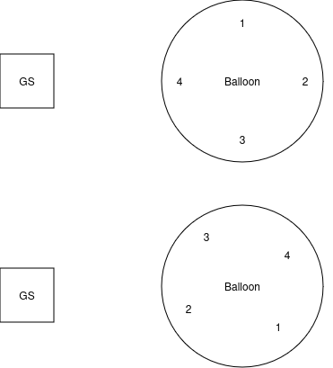

# Ratatosk antenna decider
Decides which antenna to use based on the rotation of the balloon. The rotation (also reffered to as heading or azimuth) is determined from a multi antenna input using the [Septentrio Mosaic-H evaluation kit](https://www.septentrio.com/en/products/gnss-receivers/gnss-receiver-modules/mosaic-h-evaluation-kit) 

### Choosing the right antenna
Out of 4 possible antennas the one pointing the most directly to the groundstation should be chosen. In the two cases below, respectevely antenna 4 and antenna 2 is chosen. 

The 4 patch antennas 1, 2, 3, 4 should initially be placed such that 1 points to north/(front), 2 to east/(right) and so on. On initital placement the heading is of course 0°. If the groundstation is located west (270°) of the balloon antenna 4 is chosen. 

If the balloon then rotates s.t. the heading is 140° we calculate 

$$
(groundstationDirection - balloonRotation) \mod 360 
$$

in this case 

$$ 
(270 - 140) \mod 360 =130 
$$

Based on the initial placement of antennas configured for the cardinal directions we can see the heading 130° is closer to 90° than 180° meaning we choose antenna 2.  

The fomula for calculating rotation: https://www.omnicalculator.com/other/azimuth#azimuth-formula

## Install instructions
1. Create the virtual environment `python3 -m venv venv`
2. Activate the virtual environment `source venv/bin/activate`
3. Install the required packages `python3 -m pip install -r requirements.txt` (use `py` instead of `python3` on windows) 
4. Add user to allow reading serial: `sudo usermod -a -G dialout $USER` (For Linux, if on Windows or MacOS figure out how to access serial)
5. run with `python3 -m main.nmeaparser`

## Updating dependencies
Do `python3 -m pip freeze > requirements.txt`

## Tests
Run tests from project root `python3 -m tests.antennaselector_test`
This esnures python can see both main and tests package. 
